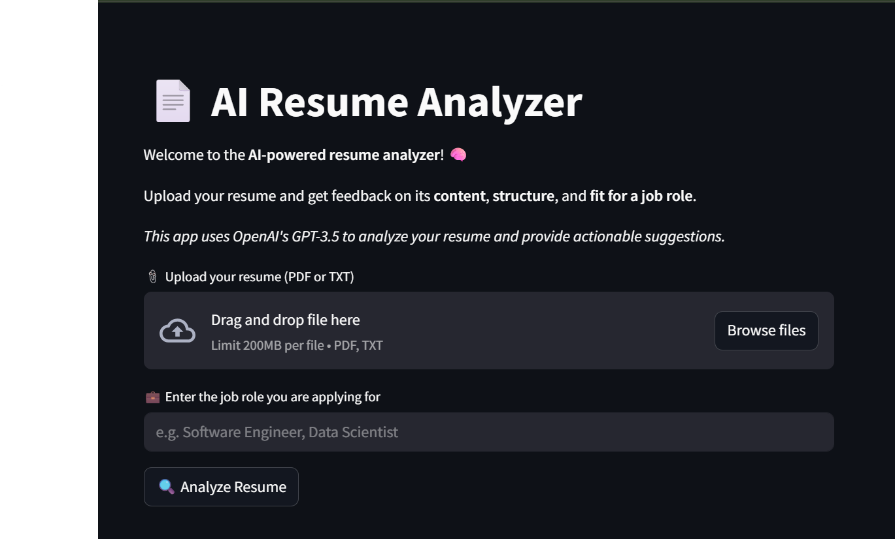

# AI Resume Analyzer

**AI Resume Analyzer** is a smart, lightweight web application built with Streamlit that evaluates resumes
and provides constructive feedback using OpenAI's GPT-3.5 model (or any other compatible LLM API).
Users can upload their resume (in PDF or TXT format), specify the desired job role, and receive actionable
suggestions to improve both content and structure.
---
## How to Use
# 1. Clone the repository
git clone https://github.com/khalildabbah/Ai_Resume_Analyzer.git
cd Ai_Resume_Analyzer
# 2. Install dependencies using uv
uv pip install streamlit openai python-dotenv PyPDF2
# 3. Configure your OpenAI API key
# Create a .env file with the following content:
echo OPENAI_API_KEY=your_openai_api_key_here > .env
# 4. Launch the application
uv run streamlit run main.py
---
## Notes
- The application supports PDF and TXT resume formats.
- An OpenAI API key is required to interact with the GPT model.
- Suggestions are generated using GPT-3.5, but output should be reviewed and adapted before final use.
---
## License
This project is intended for educational and personal use only
